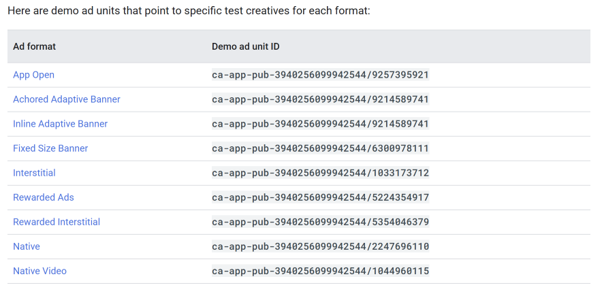

# Ad Mob Integration

Using Android Studio, Google AdMob Test Ads

Prerequisite SDK for displaying ads: Google Mobile Ads (GMA) SDK.

## Discussion Point

Enabling **Hardware Acceleration**. Globally, or per activity? This is needed for Video in banner ads.

- We can do it at the window level too, but then we cannot disable hardware acceleration.

If we choose to do per activity, we can modify the activity element’s attribute as we need.

```xml
<application android:hardwareAccelerated="false">
    <activity ... />
    <activity android:hardwareAccelerated="true" />
</application>
```

```kts
window.setFlags(
        WindowManager.LayoutParams.FLAG_HARDWARE_ACCELERATED,
        WindowManager.LayoutParams.FLAG_HARDWARE_ACCELERATED
)
```

## Ad ID



We will be using

<mark>
ca-app-pub-3940256099942544/9214589741
</mark>

## MainActivity.kt

Initialize after OnCreate:

```kt
// 1. Initialize the SDK on a background thread (Dispatchers.IO)
        val backgroundScope = CoroutineScope(Dispatchers.IO)
        backgroundScope.launch {
            MobileAds.initialize(
                this@MainActivity,
                InitializationConfig.Builder("ca-app-pub-3940256099942544~3347511713").build()
            ) { status ->
                // Initialization complete
            }
        }
```

Add this to bottom

```kt
@Composable
fun DynamicBannerAd(modifier: Modifier = Modifier) {
val context = LocalContext.current
var adViewInstance: AdView? by remember { mutableStateOf(null) }

    // Cleans up the AdView when the composable leaves the screen
    DisposableEffect(Unit) {
        onDispose {
            adViewInstance?.destroy()
        }
    }


    AndroidView(
        modifier = modifier.fillMaxWidth(),
        factory = { ctx ->
            AdView(ctx).apply {
                adUnitId = " ca-app-pub-3940256099942544/9214589741"
                
                // Dynamically calculates ad size based on device width
                setAdSize(getAdSize(ctx))
                
                loadAd(AdRequest.Builder().build())
            }
        }
    )
  }
```

Helper function to get current screen width for adaptive AdSize

```kt
private fun getAdSize(context: Context): AdSize {
    val displayMetrics = context.resources.displayMetrics
    val adWidthPx = displayMetrics.widthPixels
    val density = displayMetrics.density
    val adWidth = (adWidthPx / density).toInt()
    
    return AdSize.getCurrentOrientationAnchoredAdaptiveBannerAdSize(context, adWidth)
}
```

So that you can simply use this in SetContent

```kt
DynamicBannerAd(
                modifier = Modifier
                    .fillMaxWidth()
                    .align(Alignment.BottomCenter)
                )
```

The banner ad is written as a composable so that the Frontend Team can easily use it like any other Composable – allowing them to place it inside a row, column, or box at the bottom of the game screen. The code could look like this, what THEY will do with it

```kt
DynamicBannerAd(
                modifier = Modifier.align(Alignment.BottomCenter)
                )
```

Layout Sizing: 

The AdSize.BANNER standard is 320x50 dp. AndroidView reserves this space so the ad doesn't pop in abruptly and push your game UI around. But above is the code for adaptive banner ad sizes.


Backend Integration:

Add internet permissions and google’s sample app ID

## AndroidManifest.xml


Hardware acceleration at the global level:

```xml
<application android:hardwareAccelerated="true" ...>
```

```xml
<uses-permission android:name="android.permission.INTERNET" />
<application ...>
<!-- Sample AdMob App ID for testing -->
<meta-data 
android:name="com.google.android.gms.ads.APPLICATION_ID" 
android:value="ca-app-pub-3940256099942544~3347511713"/> 
</application>
```

Releasing an ad (on game close)

```kt
DisposableEffect(Unit) { onDispose { bannerAdState?.destroy() } }
```

## build.gradle.kts

Gradle Dependency

```kts
dependencies {
    implementation("com.google.android.gms:play-services-ads:23.0.0")
}
```

Insert in gradle settings file:

## Settings.gradle.kts

Under pluginManagement, and repositories:

```kts
    google()
    mavenCentral()

Under dependencyResolutionManagement{
  repositoriesMode.set(RepositoriesMode.FAIL_ON_PROJECT_REPOS)
  repositories {
    google()
    mavenCentral()
  }
}
```

Sources

https://developers.google.com/admob/android/next-gen/test-ads#demo_ad_units 

https://developers.google.com/admob/android/next-gen/quick-start 

https://developers.google.com/admob/android/next-gen/banner 

https://developer.android.com/topic/performance/hardware-accel 
